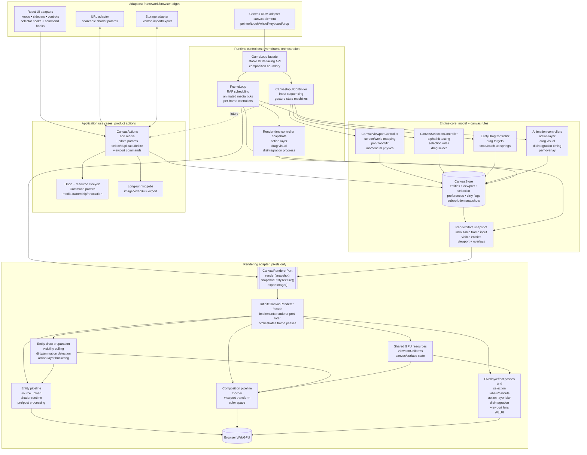
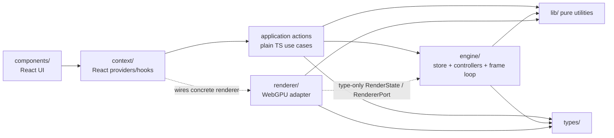

# Architecture

```mermaid
flowchart LR
  %% Voidmesh canvas-focused architecture

  user(("User input<br/>pointer • touch • wheel<br/>drop • paste • keyboard"))

  subgraph UI["React shell — light canvas-facing UI"]
    app["App providers<br/>CanvasProvider wraps canvas feature"]
    infinite["InfiniteCanvas component<br/>DOM canvas + container<br/>event wiring"]
    knobs["Shader knobs / sidebars<br/>param editing<br/>selection controls"]
    mediaControls["Media controls<br/>play/pause/seek/scrub"]
  end

  subgraph Context["Canvas context — React mutation boundary"]
    commands["CanvasCommands<br/>add/update/delete/select<br/>params • export • undo"]
    rendererSvc["CanvasRendererService<br/>register renderer<br/>color/debug services"]
    urlState["URL shader state<br/>nuqs query params"]
    undo["Undo stack<br/>Command pattern<br/>resource ownership"]
  end

  subgraph Engine["Engine — GPU-agnostic model + controller"]
    store[("CanvasStore<br/>entities • viewport • selection<br/>dirty flags • version counters")]
    gameLoop["GameLoop<br/>public facade<br/>composition boundary"]
    inputController["CanvasInputController<br/>pointer/touch/wheel<br/>gesture state machines"]
    frameLoop["FrameLoop<br/>RAF scheduling<br/>animated media ticks<br/>render decisions"]
    controllers["Per-frame controllers<br/>momentum<br/>viewport animation<br/>action layer<br/>drag visual<br/>disintegration timing<br/>perf overlay"]
    renderState["RenderState snapshot<br/>viewport<br/>sorted entities<br/>selection<br/>dirty flags<br/>overlay state"]
    renderRuntime["Render-time controller snapshots<br/>action-layer offset/blur<br/>drag visual scale/phase<br/>disintegration overlay progress"]
  end

  subgraph MediaLib["Media + pure libraries"]
    mediaLoader["Media loading<br/>images • video • GIF • SVG<br/>palette extraction"]
    math["Canvas math<br/>world/screen transforms<br/>bounds • hit testing<br/>zoom/pan"]
    serialization["Workspace serialization<br/>.vdmsh import/export"]
    palette["Palette store/config<br/>presets • custom • extracted"]
  end

  subgraph Renderer["Renderer — WebGPU pixels"]
    canvasRenderer["InfiniteCanvasRenderer<br/>facade<br/>frame orchestration"]
    color["GPU color config<br/>Display P3 probe<br/>canvas/intermediate formats"]
    viewportUniforms["ViewportUniforms<br/>shared viewport matrix buffer"]
    textures["EntityTexturePipeline<br/>source textures<br/>processed textures<br/>TexturePool"]
    shaderRuntime["EntityShaderRuntime<br/>effect dispatch"]
    shaders["Shader passes + WGSL<br/>dithering • halftone • ascii<br/>glass • blobs • melt • glitch"]
    processing["ProcessingPipeline<br/>adjustments<br/>blur<br/>bloom<br/>grain<br/>chromatic aberration"]
    composite["Composition pass<br/>viewport transform<br/>z-order compositing"]
    overlays["Canvas overlays<br/>grid<br/>selection rects<br/>entity labels/callouts<br/>action-layer blur<br/>disintegration particles"]
    lensAndWlur["Full-canvas effects<br/>viewport lens<br/>WLUR overlay"]
    gpu[("Browser WebGPU<br/>GPUDevice<br/>GPUCanvasContext")]
  end

  subgraph Outputs["Outputs"]
    screen(("Visible canvas"))
    imageExport["Image export<br/>PNG/JPEG readback"]
    videoExport["Video/GIF export<br/>main-thread render<br/>worker encode/mux"]
  end

  user --> infinite
  user --> knobs
  user --> mediaControls

  app --> infinite
  app --> commands
  infinite -->|registerRenderer| rendererSvc
  infinite -->|pointer/touch/wheel/keyboard| gameLoop
  infinite -->|drop/paste files| mediaLoader

  knobs -->|param changes| commands
  mediaControls -->|playback changes| commands
  commands <--> urlState
  commands --> undo
  commands --> store
  mediaLoader --> commands
  palette --> commands
  serialization --> commands

  gameLoop --> inputController
  gameLoop --> frameLoop
  inputController -->|mutates viewport/selection/entities| store
  inputController --> controllers
  controllers --> store
  frameLoop --> controllers
  frameLoop -->|per animation frame| renderState
  frameLoop -->|attach render-time controller data| renderRuntime
  store -->|getRenderState| renderState
  renderRuntime --> renderState

  rendererSvc --> canvasRenderer
  frameLoop -->|render| canvasRenderer
  renderState --> canvasRenderer

  canvasRenderer --> color
  canvasRenderer --> viewportUniforms
  canvasRenderer --> textures
  canvasRenderer --> shaderRuntime
  shaderRuntime --> shaders
  shaderRuntime --> processing
  processing --> textures
  canvasRenderer --> composite
  canvasRenderer --> overlays
  canvasRenderer --> lensAndWlur
  composite --> gpu
  overlays --> gpu
  lensAndWlur --> gpu
  gpu --> screen

  commands --> imageExport
  canvasRenderer --> imageExport
  canvasRenderer --> videoExport

  math -. used by .-> inputController
  math -. used by .-> canvasRenderer
  store -. selective subscriptions .-> knobs
  store -. viewport/selection snapshots .-> infinite

  classDef react fill:#20263a,stroke:#7aa2f7,color:#dbe7ff
  classDef context fill:#24331f,stroke:#9ece6a,color:#ecffd8
  classDef engine fill:#332b1f,stroke:#e0af68,color:#fff0d0
  classDef renderer fill:#331f2f,stroke:#f7768e,color:#ffe1ea
  classDef lib fill:#1f3331,stroke:#73daca,color:#dcfffb
  classDef output fill:#2d2338,stroke:#bb9af7,color:#f2e8ff

  class app,infinite,knobs,mediaControls react
  class commands,rendererSvc,urlState,undo context
  class store,gameLoop,inputController,frameLoop,controllers,renderState,renderRuntime engine
  class mediaLoader,math,serialization,palette lib
  class canvasRenderer,color,viewportUniforms,textures,shaderRuntime,shaders,processing,composite,overlays,lensAndWlur,gpu renderer
  class screen,imageExport,videoExport output
```



## Core loop

```mermaid
sequenceDiagram
  autonumber
  participant IC as InfiniteCanvas
  participant GL as GameLoop
  participant Input as CanvasInputController
  participant Loop as FrameLoop
  participant CS as CanvasStore
  participant RS as RenderState
  participant R as InfiniteCanvasRenderer
  participant GPU as WebGPU

  IC->>GL: pointer/touch/wheel/keyboard events
  GL->>Input: delegate input API calls
  Input->>CS: mutate viewport, selection, entities
  Loop->>Input: process hover/drag state each RAF frame
  Loop->>CS: tick animated media and getRenderState()
  CS-->>RS: viewport + entities + dirty flags + overlay state
  Loop->>R: render(RenderState)
  R->>R: upload dirty source textures
  R->>R: run entity shader + processing pipeline
  R->>R: composite entities with viewport transform
  R->>R: draw grid/selection/action/disintegration overlays
  R->>GPU: submit command buffer
  GPU-->>IC: present canvas frame
```

# Canvas Architecture Proposal

This document is canvas-focused. It describes the current shape, where separation of
concerns is strong, where it is blurry, and a simpler target architecture that can be
reached incrementally.

## Assessment

I would rate the current architecture about **7/10**.

### What is already working

- The biggest boundary is correct: the **engine is GPU-agnostic** and the
  **renderer owns WebGPU resources**.
- `types/` sits at the bottom of the dependency graph, which keeps the domain model
  reusable across React, engine, renderer, serialization, and export code.
- `CanvasStore` uses selective snapshots and version counters, so high-frequency
  viewport changes do not have to re-render the whole React tree.
- `GameLoop` is now a small engine facade that composes `CanvasInputController` and
  `FrameLoop`, so DOM callers keep a stable API while input state and RAF scheduling
  live behind separate seams.
- `FrameLoop` owns RAF scheduling, animated media ticks, dirty checks, render-state
  assembly, and `renderer.render(snapshot)` calls through `CanvasRendererPort`.
- `InfiniteCanvasRenderer` consumes a `RenderState` snapshot instead of reaching into
  React state.
- GPU resource ownership is mostly centralized in renderer/pipeline classes.

### What is blurry

- `CanvasProvider` is doing several jobs: React context wiring, URL state sync,
  canvas commands, undo resource ownership, media lifecycle, image export, renderer
  registration, and error handling.
- `InfiniteCanvas` is a view component, but it also wires a lot of product behavior:
  DOM events, keybind behavior, renderer configuration, canvas controls, drop/paste,
  studio file import/export, and viewport actions.
- `CanvasInputController` now has a sharper boundary than the old `GameLoop`: it owns
  event sequencing and gesture state, while selection, hit-testing, viewport/momentum,
  and entity dragging/snap behavior live in focused engine modules. It still directly
  coordinates action-layer gesture side effects, haptics/analytics, and onboarding
  completion; that is the next remaining input-side seam.
- `InfiniteCanvasRenderer` has the right ownership boundary, but internally it is a
  large facade over WebGPU setup, entity rendering, composition, overlays, caches,
  export readback, and device-loss handling.

## Engine split status

The first engine split is complete enough that the runtime responsibilities are no
longer centered in one large `GameLoop` class:

- `GameLoop` remains the stable public facade used by React/DOM callers. It constructs
  dependencies, delegates input methods, wires render errors, and composes the input
  and frame loops.
- `CanvasInputController` owns pointer, wheel, context-menu, touch, space-pan,
  long-press action-layer, double-tap/hold gesture state, and input momentum samples.
- `CanvasSelectionController` owns alpha hit-testing, pointer/touch selection rules,
  drag-select selection updates, multi-select bounds, context-menu selection setup,
  and playback-toggle decisions from clicks/taps.
- `CanvasViewportController` owns screen/world conversion, wheel/pinch/double-tap zoom,
  viewport panning, fit-to-entity animation, saved zoom-back viewport state, and
  `MomentumController` integration.
- `EntityDragController` owns active drag targets, selected-entity movement,
  snap-to-grid accumulation, action-layer-to-drag catch-up, and snap-settle springs.
- `FrameLoop` owns RAF scheduling, scheduler ticks, GIF/video playback advancement,
  video frame callback tracking, render-state enrichment, render/no-render decisions,
  dirty-flag clearing, and calls to `CanvasRendererPort.render()`.
- Render-time controller data crosses the engine → renderer boundary as
  `RenderState` fields: action layer, drag visual, disintegration, drag-select bounds,
  and multi-select bounds.

The remaining blurriness is smaller and mostly action-layer related:

- `CanvasInputController` still decides when the long-press action layer opens,
  transitions to entity drag, dismisses, and emits haptics/analytics/onboarding
  events. A future `ActionLayerGestureController` could own that orchestration.
- `CanvasSelectionController` and `CanvasViewportController` still mutate
  `CanvasStore` directly. That matches the current engine style, but a future
  `CanvasActions` layer could turn those mutations into named product use cases.

## Renderer split status

The renderer split is intentionally incremental. `InfiniteCanvasRenderer` is still the
public facade, but most heavy GPU ownership has moved into smaller renderer-owned
classes.

Completed internal seams:

- `EntityTexturePipeline` / `EntityShaderRuntime`: source upload, source/processed
  texture caching, shader dispatch, and processing pipeline ownership.
- `CompositionPass`: composition pipelines, per-entity uniform buffers, bind groups,
  and composition cache invalidation.
- `EntityDrawItemPreparer`: visible-entity traversal, culling, dirty/animation
  detection, action-layer bucketing, drag visual scale, and composition draw-item
  creation.
- `RenderState` render-time controller snapshots: action-layer offset/blur, drag
  visual scale/phase, and disintegration overlay progress now cross the engine →
  renderer boundary as data instead of renderer modules importing engine singletons.
- `ViewportUniforms`: shared viewport matrix buffer used by composition, labels,
  callouts, and disintegration overlays.
- Overlay/effect passes: `GridPass`, `SelectionRectPass`, `DisintegrationPass`,
  `ViewportLensPass`, `ActionLayerBlurPass`, and `WlurOverlayPass`.
- `ExportService`: image/GIF/video export helpers that render through the existing
  entity shader path.

What remains in `InfiniteCanvasRenderer` should be orchestration or public facade work:

- WebGPU adapter/device/context setup and device-loss hooks.
- Canvas sizing and swapchain texture acquisition.
- Per-frame pass order.
- Render pass encoding and draw submission for main entities, action-layer sharp
  entities, overlays, viewport lens, and WLUR.
- Public methods used by context/UI: renderer config, export helpers, entity time
  helpers, entity texture removal, and disintegration start/cancel.
- A few snapshot/copy helpers that still belong to later resource-lifecycle seams.

`EntityDrawItemPreparer` now owns the visible-entity loop while the facade still owns
actual render pass encoding, label drawing, and final overlay ordering. The next likely
renderer seams are canvas surface/device setup and disintegration snapshot creation.
Renderer internals should keep consuming `RenderState` or explicit renderer-private
dependencies; importing engine singletons from renderer modules is not part of the
target architecture.

## Would MVC help?

Classic MVC roughly maps like this:

| MVC role   | Voidmesh equivalent                                                                                   |
| ---------- | ----------------------------------------------------------------------------------------------------- |
| Model      | `CanvasStore`, `ShaderCanvasEntity`, `Viewport`, palettes, shader params                              |
| View       | React controls **and** the WebGPU canvas                                                              |
| Controller | `GameLoop` facade, `CanvasInputController`, `FrameLoop`, canvas commands, keybind/drop/paste handlers |

That mapping is useful vocabulary, but a strict MVC rewrite would not simplify the
app much. Voidmesh has two very different views:

1. a React UI that edits state, and
2. a high-frequency WebGPU viewport that renders state.

The better target is a **model + use-cases + adapters** architecture:

- **Model** stores canonical canvas state.
- **Use cases** mutate the model through named product actions.
- **Input adapters** translate DOM events into those actions.
- **Render adapters** turn snapshots into pixels.
- **React adapters** expose commands and selector hooks to UI components.

This gives the useful parts of MVC without forcing a real-time rendering app into a
request/response web-app shape.

## Proposed simpler architecture



## Target responsibility boundaries

| Area                   | Owns                                                             | Should not own                                                   |
| ---------------------- | ---------------------------------------------------------------- | ---------------------------------------------------------------- |
| React components       | DOM layout, user-facing controls, calling hooks                  | Canvas business rules, direct `CanvasStore` reads, GPU calls     |
| React context/hooks    | Exposing selectors and stable command objects                    | Large command implementations, media cleanup rules, render logic |
| Application actions    | Product use cases and undoable state mutations                   | DOM event details, React state, WebGPU resources                 |
| `CanvasStore`          | Canonical canvas state, dirty flags, snapshots                   | File loading, URL parsing, GPU cleanup, gesture interpretation   |
| Input controllers      | Translating pointer/touch/wheel/key events into intents          | Rendering, media loading, React UI state                         |
| Frame loop             | RAF scheduling and deciding when to render                       | Gesture rules, shader details, command implementations           |
| Renderer port          | A small interface the engine can call                            | Concrete WebGPU setup details in engine code                     |
| WebGPU renderer        | GPU resources, texture caches, shader/composition/overlay passes | Canvas state mutation, React subscriptions, product commands     |
| Media/resource service | Creating/cloning/destroying browser media resources              | Selection rules, rendering passes, UI layout                     |

## Simplified runtime flow

```mermaid
sequenceDiagram
  autonumber
  participant User
  participant DOM as Canvas DOM adapter
  participant GL as GameLoop facade
  participant Input as CanvasInputController
  participant Rules as Selection/Viewport/Drag controllers
  participant Actions as CanvasActions
  participant Store as CanvasStore
  participant Loop as FrameLoop
  participant Renderer as CanvasRendererPort
  participant GPU as WebGPU

  User->>DOM: pointer / touch / wheel / keyboard / drop
  DOM->>GL: existing public event API
  GL->>Input: delegate input handling
  Input->>Rules: delegate selection, drag, pan, zoom work
  Rules->>Store: mutate canonical canvas state
  Input-->>Actions: future: emit product intents<br/>instead of direct store writes
  Actions->>Store: mutate canonical canvas state
  Loop->>Store: get render snapshot on RAF/media tick
  Store-->>Loop: RenderState snapshot
  Loop->>Renderer: render(snapshot)
  Renderer->>GPU: encode + submit passes
```

## Incremental migration plan

This should not be a rewrite. Keep the working public APIs and split one seam at a
time.

1. **Done: keep `gameLoop` as a facade, split its internals.**
   - `CanvasInputController` owns pointer/touch/wheel/context-menu/space-pan gesture
     state machines.
   - `FrameLoop` owns RAF scheduling, animated media ticks, dirty checks, and
     `renderer.render(snapshot)` through `CanvasRendererPort`.
   - Existing components can still call `gameLoop.handlePointerDown()` while the
     facade delegates internally.

2. **Move command bodies out of `CanvasProvider`.**
   - Create canvas action modules for add/update/delete/duplicate/select/viewport
     operations.
   - Keep the provider as composition glue: construct actions, provide contexts,
     connect URL sync, and handle toasts/errors.
   - This makes commands testable without React.

3. **Make renderer dependency explicit.**
   - Define a small `CanvasRendererPort` interface consumed by the frame loop.
   - `WebGPUCanvasRenderer` implements that port.
   - The engine should not know about concrete renderer internals beyond the port.

4. **Extract media resource lifecycle.**
   - Centralize clone/destroy/revoke behavior for images, videos, GIF frames, and SVG
     bitmaps.
   - Undo commands should claim ownership through this service instead of keeping
     cleanup details inside React context.

5. **Keep `InfiniteCanvasRenderer` as a facade, split renderer internals only where it
   reduces complexity.**
   - Completed seams include entity texture/shader runtime, composition, viewport
     uniforms, render-time controller snapshots, export/readback, and individual
     overlay/effect passes.
   - Next seams should be ownership-based, not file-size-based: canvas surface/device
     setup, disintegration snapshot creation, then an optional overlay coordinator if
     pass orchestration still feels noisy.
   - Do not leak WebGPU resources outside renderer-owned classes.

## What not to do

- Do not pursue MVC as a goal by itself. The useful goal is smaller ownership
  boundaries, not terminology.
- Do not create many new React providers. Prefer plain modules/services behind the
  existing canvas context.
- Do not move GPU logic into context or components.
- Do not replace `CanvasStore` unless a concrete performance or correctness problem
  appears; its snapshot/version design fits this app well.
- Do not split shader code just to make files smaller. Split around ownership:
  source upload, effect processing, composition, overlays, export.

## Target dependency direction

Arrows point from code that imports to code it is allowed to import.



The key rule: **state changes flow through application actions into `CanvasStore`; pixels
flow from a `RenderState` snapshot into the renderer.** Keeping those flows separate is
the main architectural simplification.

## Deep module boundaries

Canvas capabilities follow the deep-module principle: public interfaces stay small while
their implementations hide substantial coordination. `CanvasInteractionService` and
`CanvasMediaService` are the primary application modules in this shape. Their callers see
points, surface metrics, media actions, and named canvas operations; they hide the store,
game loop, viewport animation, selection-bound calculation, and playback dispatch.

This provides four concrete benefits:

- UI changes do not spread into engine orchestration code.
- Engine internals can be replaced or dependency-injected without rewriting components.
- Business behavior is testable without rendering React or constructing WebGPU resources.
- The allowed dependency graph becomes enforceable because callers have a legitimate
  public interface to use instead of reaching for a singleton.

`plugins/oxlint-import-policy.js` enforces the graph. It reads `package.json#imports` to
compile exact and wildcard aliases, requires `#...` imports across module boundaries, and
rejects upward dependencies. Exact entrypoints such as `#engine` are treated as public
module surfaces, so relative deep imports cannot bypass them. The policy applies to every
source file without an exception list.
