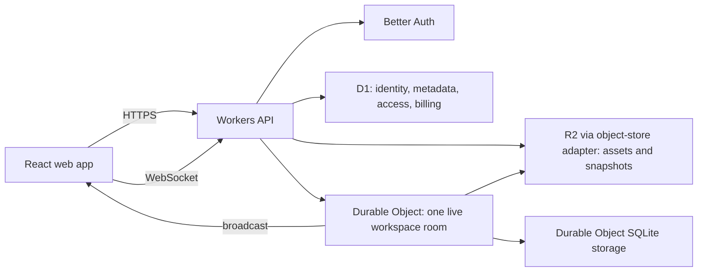

# Voidmesh hosted workspaces

Status: draft product and technical specification

## 1. Purpose

Voidmesh hosted workspaces add an account-backed cloud product to the existing local-first canvas. The hosted product persists workspaces and media, supports controlled sharing, and lets multiple authorized clients edit the same canvas in real time.

The existing local application remains useful without a hosted account. A `.vdmsh` archive remains the portable import/export format. Hosted workspaces use a decomposed document and asset model rather than treating the archive as the live storage unit.

This specification uses the behavior implemented on `feature/p2p-canvas-multiplayer` as the baseline for presence, media playback, animated shader synchronization, asset identity, placeholders, and remote projection. It replaces the prototype's peer-to-peer transport and peer-owned state with a Cloudflare Worker API and one Durable Object per active workspace.

## 2. Product principles

- Local workspaces must not require an account or network connection.
- A hosted workspace has one stable ID and one authoritative access policy.
- The API is the only public authorization and entitlement boundary.
- Collaborators see changes quickly, but durable recovery is more important than preserving an individual connection.
- Media bytes are stored independently from the workspace document and are not retransmitted between peers.
- Presence is ephemeral. It never becomes part of workspace history or billing usage.
- Portable formats and the object-store boundary must not depend on R2-specific APIs where the S3-compatible API is sufficient.
- Limits are represented as account entitlements, not scattered product-tier conditionals.

## 3. Scope

### 3.1 Initial scope

- Account signup, login, email verification, password reset, and sessions.
- Hosted workspace creation, listing, rename, open, autosave, export, soft delete, restore, and permanent deletion.
- Direct media upload through short-lived object-store credentials and authenticated media delivery through the API.
- Workspace and account storage quotas.
- Owner, editor, and viewer access.
- Revocable view and edit invitations.
- Real-time document synchronization through WebSockets.
- Indefinite offline editing and later Yjs synchronization.
- Cursor and selection presence.
- Synchronized video, GIF, and animated shader playback.
- Subscription and entitlement enforcement.
- Audit records for security- and ownership-relevant actions.

### 3.2 Explicitly out of scope for the first release

- Peer-to-peer WebRTC transport, Nostr signaling, or TURN credentials.
- Anonymous workspace access.
- Branching, comments, chat, voice, or presentation mode.
- Organizations, teams, or custom roles beyond owner/editor/viewer.
- End-to-end encryption.
- A public plugin or third-party API.

## 4. Product tiers and entitlements

The commercial limits are intentionally data-driven. Exact Pro limits remain a product decision.

| Capability            |           Local free | Cloud free, proposed |             Pro, TBD |
| --------------------- | -------------------: | -------------------: | -------------------: |
| Account required      |                   No |                  Yes |                  Yes |
| Local workspaces      | Unlimited by product | Unlimited by product | Unlimited by product |
| Hosted workspaces     |                    0 |                    1 |          Entitlement |
| Hosted storage        |                    0 |  1 GiB account total |          Entitlement |
| Per-workspace storage |                    0 |                1 GiB |          Entitlement |
| Editors               |                    0 |           Owner only |          Entitlement |
| View sharing          |    Local file export |                  Yes |                  Yes |
| Edit sharing          |                   No |                   No |                  Yes |
| User-visible history  |                   No |                   No |                   No |

Cloud free is a distinct hosted tier; it does not limit the permanently free local application. Every account has exactly one active plan. Limits are enforced from an entitlement snapshot derived from that plan and its subscription state. Plans may independently raise the account-wide workspace count, account-wide storage, and per-workspace storage limits. Edit collaboration is a paid entitlement; authenticated view sharing is available on Cloud Free.

An upload may start while both the account and workspace are at or below quota, and that one asset may finish even if it crosses a soft quota. Once either scope is over quota, new uploads and asset replacements that increase stored bytes are blocked. A separate hard per-asset safety limit always applies. Existing workspaces remain readable and exportable, and byte-neutral edits, destructive operations, and operations that reduce storage remain available. A lapsed paid subscription therefore degrades to read-only-over-quota behavior rather than making customer data inaccessible.

## 5. System architecture



### 5.1 Authority boundaries

There is no single database that owns every kind of state:

- **Workers API:** public trust boundary. Authenticates the caller, resolves entitlements, authorizes requests, issues upload/download grants, and routes WebSockets.
- **D1:** authority for users, workspace metadata and lifecycle, memberships, invitations, subscriptions, entitlements, storage accounting, and audit records.
- **Workspace Durable Object:** authority for the live Yjs document, accepted update ordering, connection membership, presence routing, and playback anchors.
- **Durable Object storage:** strongly consistent recovery data for the live room, including its latest compacted Yjs state and updates not yet included in an R2 snapshot.
- **R2:** durable immutable media objects, workspace snapshots, previews, and generated exports.
- **Client:** optimistic projection and local rendering only. It is never authoritative for access, quotas, revisions, or durable state.

D1 must not store the large workspace document or high-frequency presence/playback events. The Durable Object must not become the authority for billing or durable membership.

### 5.2 Monorepo target

```text
apps/
  web/                  React/Vite application
  api/                  Worker routes and workspace Durable Object
packages/
  domain/               IDs, roles, entitlements, operations, and policies
  api-contract/         Validated HTTP and WebSocket schemas plus typed client
  workspace-format/     Hosted document schema, migrations, import, and export
  collaboration/        Yjs, presence, playback, and reconciliation protocol
  database/             D1 schema, queries, and migrations
  object-store/         Narrow S3-compatible asset and snapshot interface
```

The migration to a monorepo should preserve the current subsystem boundaries inside `apps/web`. Shared packages expose contracts and pure domain code; the web app must not import API, D1, or Durable Object implementations.

## 6. Hosted workspace representation

The current `.vdmsh` ZIP contains a manifest and media. Hosted storage decomposes those parts:

```text
assets/{asset-id}/{asset-revision-or-content-hash}
workspaces/{workspace-id}/snapshots/{room-sequence}.yjs
workspaces/{workspace-id}/previews/{room-sequence}.webp
workspaces/{workspace-id}/exports/{export-id}.vdmsh
```

The exact prefix is an implementation detail behind the object-store interface. Database rows store opaque object keys; application code must not derive authorization from a key name.

### 6.1 Workspace document

The hosted document contains the portable canvas state:

- Schema version, Yjs document identity, and latest room sequence.
- Viewport.
- Entity identity, geometry, layer order, locked state, and appearance.
- Shader parameters and palettes.
- Asset references and media metadata.
- Resting playback state and authoritative playback anchors.

It excludes:

- User sessions and permissions.
- Cursor and selection presence.
- Upload reservations.
- Object-store URLs or credentials.
- Browser-only media elements, GPU resources, caches, or renderer state.

Every accepted update batch increments a monotonically increasing room sequence. Snapshots are immutable and include that sequence. Yjs state vectors determine which document updates a joining or reconnecting client is missing; room sequences provide acknowledgement, persistence ordering, and diagnostics rather than conflict resolution.

### 6.2 Media assets

An asset is independent of the entities that reference it. Multiple entities may reference one asset without duplicating bytes. Each asset records:

- Stable asset ID.
- Owning workspace or account.
- Object key.
- Media type and original filename.
- Verified byte length.
- SHA-256 content hash.
- Revision if its bytes can be replaced.
- Width, height, duration, frame rate, and audio metadata when available.
- ThumbHash or another bounded preview representation.
- Lifecycle state: reserved, uploaded, verified, active, unreferenced, or deleting.

The prototype's content-addressing, preview-first placeholders, shared decoded image assets, bounded transfer work, and integrity checks remain relevant. R2 replaces peer asset transfer: collaborators fetch the same verified object instead of requesting it from another browser.

### 6.3 Import and export

- Import validates and migrates a `.vdmsh` archive locally before any hosted mutation.
- Assets are uploaded independently and verified before the workspace document references them.
- The client derives a bounded first-frame WebP thumbnail while the media is already decoded. The
  thumbnail is reserved, verified, authorized, and deleted with its original; library grids never
  fetch originals for previews.
- The final document replacement is one Yjs transaction and one undo boundary.
- Export reads a consistent Yjs state at a known room sequence and assembles a `.vdmsh` archive asynchronously.
- Export must remain available while an account is over quota or pending deletion during its recovery window.

## 7. Identity, access, and sharing

### 7.1 Authentication

Better Auth runs in the Worker with a D1-compatible SQLite adapter. The initial release supports email and password. The schema and UI must leave room for social providers and multiple verified identities later.

Required flows:

- Signup with email verification.
- Login and logout from one or all sessions.
- Password reset.
- Session rotation and revocation.
- Rate limiting and Turnstile on abuse-prone public endpoints.
- Account deletion with explicit handling of owned shared workspaces.

### 7.2 Roles

| Action                     | Owner |                      Editor | Viewer |
| -------------------------- | ----: | --------------------------: | -----: |
| Open workspace and assets  |   Yes |                         Yes |    Yes |
| Publish presence           |   Yes |                         Yes |    Yes |
| Edit document and playback |   Yes |                         Yes |     No |
| Upload or remove assets    |   Yes |                         Yes |     No |
| Download original media    |   Yes |                         Yes |    Yes |
| Export workspace           |   Yes | Configurable, initially yes |     No |
| Invite or remove members   |   Yes |                          No |     No |
| Change role                |   Yes |                          No |     No |
| Delete workspace           |   Yes |                          No |     No |

The owner is represented as a membership with the owner role, but D1 constraints must guarantee exactly one owner for an active workspace. Ownership cannot be transferred. The account that originally created the workspace owns its stored assets, is billed for them, and controls the workspace lifecycle. An asset's uploader is retained as attribution only; uploader departure or account deletion does not remove the asset from the workspace.

### 7.3 Invitation links

Every workspace participant must have an account. View and edit invitation links require signup or login before redemption. Successful redemption creates a durable viewer or editor membership for that user.

Invitation links are permanent until the owner revokes or rotates them; they do not expire automatically. Revoking a link prevents new redemptions but does not silently remove memberships already created through it. The owner removes those members explicitly when desired.

Every link has a cryptographically random token. D1 stores only a keyed hash or cryptographic hash of the token. It also stores permission, creator, revocation time, and optional maximum uses.

Opening an invitation records an access attempt. Successful redemption records the authenticated user, membership change, and audit event. Edit invitations can only be created and redeemed when the billing account has the edit-collaboration entitlement.

### 7.4 Revocation

Membership revocation must affect live sessions. A membership removal, role downgrade, or workspace deletion notifies the workspace Durable Object. It reauthorizes affected connections, disconnects those without view access, and immediately rejects document updates from viewers. Invitation-link revocation only prevents future redemptions; it does not affect memberships already created through that link.

## 8. WebSocket session lifecycle

1. The client loads workspace metadata through the API.
2. The API verifies the account session and active workspace membership, then resolves the effective role.
3. The API routes the WebSocket upgrade to the workspace's Durable Object with a short-lived, signed authorization assertion. Raw sessions and invitation tokens are not forwarded or stored in the room.
4. The Durable Object validates the assertion, registers a unique connection ID, and associates it with user ID, role, session version, and protocol version.
5. The room sends `welcome`, containing the connection identity, room protocol version, current sequence, server time sample, collaborator list, and document synchronization instructions.
6. The client reconciles the document, fetches missing assets, then announces presence readiness.
7. The room sends existing presence snapshots to the new client and broadcasts the new participant to existing clients.
8. On close, timeout, replacement, or revocation, the room removes the connection and broadcasts `presence.leave`.

The Hibernation WebSocket API should be used. Connection attachments retain only the small identity and authorization data needed to reconstruct the connection after hibernation. Durable state is stored before acknowledging a durable update.

One user may open multiple tabs. Presence is per connection, not per account. The UI may group those connections by user visually, but the protocol must not collapse them because each tab can have a different cursor and selection.

## 9. Presence specification

Presence consists only of collaborator identity, canvas cursor, and selected entity IDs.

### 9.1 Presence state

```ts
interface WorkspacePresence {
  connectionId: string;
  userId: string;
  displayName: string;
  color: [number, number, number, number];
  cursor: { x: number; y: number } | null;
  selectedEntityIds: readonly string[];
  sequence: number;
}
```

- Cursor coordinates are world-space canvas coordinates so every viewport can render them correctly.
- `cursor: null` means the pointer is outside the canvas, the tab is hidden, or the client has intentionally cleared it.
- Selection is a snapshot, not a delta. IDs not present in the current document are ignored.
- Display name comes from the account profile. Email addresses are not exposed as presence names.
- Color is assigned deterministically by the room with collision avoidance among current participants when practical.

### 9.2 Publication rules

- Cursor changes are coalesced and sent at most once per animation frame, matching the prototype's approximately 60 Hz cap.
- Selection is sent only when its immutable selection reference or contents change.
- Pending cursor and selection changes may be combined into one message.
- Each client message includes a monotonically increasing per-connection sequence. The room and receivers ignore duplicates and older messages.
- A joining connection sends one full presence snapshot after document reconciliation.
- A hidden or suspended client clears its cursor promptly. Disconnect cleanup clears all of its presence.
- Presence messages are bounded and schema-validated. Selection length, ID length, coordinate range, and total encoded payload have protocol limits chosen from realistic stress tests.
- The room may drop intermediate presence messages under backpressure; it must preserve the newest state. Presence is never allowed to delay durable document updates.

### 9.3 Routing and rendering

- Presence is accepted from owners, editors, and viewers.
- The room broadcasts it to all current viewers except the sender.
- It is held only in room memory and WebSocket attachments as required for hibernation recovery; it is not written to D1, R2 snapshots, document history, or undo.
- Remote selections render as color-coded entity and multi-entity outlines.
- Remote cursors render with the collaborator color and display-name label.
- The dedicated WebGPU presence pass from the prototype is the rendering reference. Presence updates invalidate only the presence layer; they must not dirty entity textures or shader outputs.
- Lens distortion and other composition passes retain the prototype's intended ordering so presence appears anchored in the same canvas scene as entities.

### 9.4 Presence acceptance criteria

- Two clients see each other's cursors while moving across different viewports and zoom levels.
- Selection outlines update on select, multi-select, deselect, entity deletion, workspace replacement, tab hiding, and disconnect.
- Reordered or duplicated packets never restore stale cursor or selection state.
- A slow presence consumer does not increase durable edit latency or memory without bound.
- Presence produces no Yjs updates, room sequences, snapshots, audit rows, or storage usage.

## 10. Durable document synchronization

### 10.1 Yjs document model

The hosted product retains the Yjs document model proven on `feature/p2p-canvas-multiplayer`. Each workspace Durable Object owns the authoritative `Y.Doc`. Connected editors exchange Yjs state vectors and incremental updates with that room rather than directly with peers.

The shared document contains independently mergeable structures for:

- Entity membership, identity, geometry, and layer order.
- Shader type and shader parameters at validated leaf paths.
- Palette definitions and references.
- Verified asset references and media metadata.
- Resting media and animated-shader playback state.

Multi-entity actions execute in one Yjs transaction and one local undo boundary. Continuous geometry changes are coalesced to approximately one update per animation frame, followed by an exact final update on gesture completion.

Every incoming update includes a workspace ID, actor connection ID, client protocol version, stable update or operation ID, and bounded Yjs bytes. The room validates the actor's current editor role, protocol, update size, resulting document bounds, referenced asset IDs, and that every Yjs dependency integrated into the candidate document. Unknown or unauthorized asset IDs never become readable merely because they appear in the document. An update with missing history is rejected without advancing the room sequence or changing asset lifecycles. Accepted update batches receive a monotonically increasing room sequence for acknowledgement, persistence, diagnostics, and reconnect gap detection.

### 10.2 Offline synchronization and collaborative undo

- A client persists the Yjs document, state vector, pending updates, and stable operation IDs in IndexedDB.
- Previously opened hosted workspaces remain editable offline indefinitely.
- Larger locally required asset bytes use OPFS where supported, with a bounded fallback strategy elsewhere.
- Reconnection exchanges state vectors so client and room send only missing updates.
- Pending asset uploads finish before synchronization publishes document references to those assets.
- Yjs resolves concurrent field and collection changes; entity and field granularity must avoid treating the entire appearance object as one last-writer-wins value.
- A schema or asset failure preserves the unsynchronized local state as a recoverable local copy rather than discarding it.
- If the room no longer has history required by a local update, the client republishes its validated logical document as a fresh Yjs generation. The room checkpoints that replacement before acknowledgement and broadcasts replacement semantics so connected clients discard stale structures and rotate their client clocks before making further edits.

Collaborative undo uses an origin-scoped `Y.UndoManager`. A user's undo targets that user's tracked local transactions, not remote collaborators' operations, and the resulting undo/redo update is synchronized normally. Bulk operations remain one undo item.

Deleting an entity or removing the final asset reference does not synchronously delete media bytes. The asset becomes unreferenced and remains recoverable during a garbage-collection grace period. If an indefinitely offline client later references media that has already been collected, it must re-upload its cached copy; otherwise the entity resolves to a missing-media placeholder.

### 10.3 Persistence and recovery

- The room persists accepted incremental Yjs updates in Durable Object SQLite storage before acknowledging durable synchronization.
- It periodically compacts updates into a full encoded Yjs state and prunes superseded increments.
- An immutable R2 recovery snapshot is written at bounded sequence/time intervals and on important lifecycle transitions.
- The room records the R2 snapshot sequence only after upload succeeds.
- On construction after eviction or failure, it restores its Durable Object state and, if necessary, the latest R2 snapshot plus later retained updates.
- Internal snapshots are not a user-visible version-history or restore feature and carry no customer-facing backup guarantee.
- Passive animation progress, cursor presence, and selection presence do not create Yjs updates or snapshots.

## 11. Playback and animated shader synchronization

The prototype establishes the desired behavior. Video and GIF state includes:

```ts
interface SharedPlaybackAnchor {
  entityId: string;
  commandId: string;
  sequence: number;
  currentTime: number;
  isPlaying: boolean;
  playbackRate: number;
  loop: boolean;
  muted: boolean;
  volume: number;
  duration: number;
  effectiveAtServerMs: number;
}
```

Animated shader state uses the same model with `time` and `isPlaying` (`timeAutoPlay`) rather than media audio and loop fields.

### 11.1 Authority and clocks

- The workspace room accepts and orders every playback command.
- On acceptance it stamps the anchor with its server time and room sequence.
- Clients estimate their offset from the room clock through periodic WebSocket ping/response samples and prefer the lowest-round-trip recent sample.
- Clients no longer estimate clocks independently for every peer.
- A playing client derives passive progress from the anchor, elapsed room time, and playback rate. It does not publish `timeupdate` progress.
- The room can hibernate while playback is logically advancing because the anchor is sufficient to derive current time after wakeup.

For a non-looping asset, derived time clamps to duration and becomes logically paused at the end. For a looping asset, time wraps by duration. Loop-aware distance uses the shorter distance across the duration boundary.

### 11.2 Commands

The following user actions publish immediate commands:

- Play and pause.
- Seek and scrub.
- Loop change.
- Playback-rate change.
- Mute and volume change.
- Animated shader play/pause and explicit time change.

Scrubbing uses three phases:

1. `scrub.begin` establishes active control and the initial target.
2. Coalesced `scrub.update` commands provide responsive remote preview at no more than one per animation frame.
3. `scrub.end` sends the exact final target and is never intentionally dropped.

The initial policy is last accepted playback command wins per entity. There is no permanent playback owner or presenter lock. The UI may show who most recently controlled playback if contention becomes confusing.

### 11.3 Client application heuristics

- Apply loop, rate, mute, and volume before deciding whether to play or seek.
- Seek video or GIF media when loop-aware drift is at least 150 ms, preserving the prototype's starting threshold.
- Re-evaluate remote media and animated shader anchors every second as a drift guard.
- Do not publish drift corrections back to the room.
- On a better room-clock sample, re-project active remote anchors immediately.
- A late joiner derives the current position from the latest anchor instead of starting from its stored `currentTime`.
- A paused anchor is exact and does not advance.
- Remote projection suppresses local command echoes.

These are initial tested heuristics, not permanent product limits. Changes require cross-browser measurements with video, GIF, loop boundaries, non-1x playback, rapid scrubbing, and animated shaders.

### 11.4 Browser autoplay policy

Remote unmuted playback can be rejected by the browser. That rejection must not fail the room or rewrite the authoritative shared state.

- Remember the blocked entity locally to avoid repeated play attempts and repeated notifications.
- Show one actionable notification that playback requires a user gesture.
- Retry after an appropriate local gesture or when a later command makes the media muted.
- Clear the blocked state on pause, entity removal, asset replacement, or successful play.

### 11.5 Playback acceptance criteria

- Play, pause, seek, rapid scrub, loop, rate, mute, and volume converge across clients.
- Video and GIF drift remains within the selected correction budget during a sustained session.
- Loop-boundary correction does not seek across the long path.
- A late joiner sees the correct derived position.
- Animated shader time converges without per-frame network messages.
- Conflicting controls resolve by room sequence without echo loops.
- Unmuted autoplay rejection is visible and recoverable without changing other clients.
- Room hibernation and reconstruction preserve logical playback.

## 12. Asset upload, download, and quotas

### 12.1 Upload lifecycle

1. Editor requests an upload reservation with expected byte length, media type, filename, and optional hash.
2. The API checks the hard per-asset limit, then atomically verifies that neither workspace nor account is already above its soft quota.
3. D1 records a short-lived reservation and increments reserved bytes. This one reserved asset may complete even if its verified size takes the workspace or account over a soft quota.
4. The API returns a short-lived presigned `PUT` or multipart upload grant restricted to the intended object.
5. The browser uploads directly through the S3-compatible object-store API.
6. The browser finalizes the reservation.
7. The API verifies object existence, actual size, media type policy, and checksum when available.
8. One transaction converts reserved bytes to used bytes and marks the asset verified.
9. Only a verified asset can be referenced by an accepted Yjs document update.

Once a workspace or account is over quota, no further byte-increasing reservation can begin until usage is reduced or the plan is upgraded. Concurrent reservations are serialized against reserved bytes so only the permitted crossing upload can exceed a soft limit. Expired reservations release bytes. Lifecycle rules and a cleanup job remove incomplete multipart uploads and orphan objects.

### 12.2 Downloads

- Private assets are never exposed through a public bucket.
- Every media request requires an authenticated account session and active workspace membership.
- An authenticated Worker media gateway authorizes and streams original objects through an R2 binding. Original downloads do not use public or reusable presigned `GET` URLs.
- The gateway supports validated range requests for video, immediate membership revocation, and per-request access logging.
- Browser CORS and content headers are explicit, but they are defense in depth rather than authorization.
- SVG and other active content are served from an isolated media origin with download-safe headers; they do not execute under the application origin.
- Anyone who can render original bytes can technically save them. The product distinguishes an explicit download action from a render request in its UI and audit trail, but does not claim copy prevention.

### 12.3 Accounting

Track separately:

- Verified logical bytes charged to the account and workspace.
- Reserved bytes for incomplete uploads.
- Physical object bytes for operations and reconciliation.
- Unreferenced bytes pending garbage collection.

Asset references are counted once per owning workspace even when many entities use the asset. The workspace owns every asset and its original creator's account is billed; `uploaded_by` is attribution. Cross-account physical deduplication, if ever implemented, must not change logical billing or leak whether another customer owns identical content.

### 12.4 Asset access trail

The application records `asset.upload_reserved`, `asset.upload_completed`, `asset.read_authorized`, `asset.bytes_served`, `asset.read_denied`, `asset.download_requested`, `asset.deleted`, and `asset.restored` events. Records include request ID, timestamp, authenticated user, workspace, asset, membership role, access purpose, requested range, bytes served, status, and bounded security metadata. They never include session tokens, invitation tokens, object keys, presigned URLs, filenames, or media contents.

An explicit download event means the user invoked the product's download action. A bytes-served event means Voidmesh delivered bytes for rendering or download; the application cannot prove that rendered bytes were not saved.

Exact security events flow through a Queue into a durable append-only sink. Sampled operational analytics may additionally use Analytics Engine, but sampled data is not the authoritative access trail. R2 create/delete notifications reconcile storage mutations because Cloudflare's R2 audit log does not include object-level data access.

## 13. Core data model

The initial D1 model contains at least:

- `users`, `sessions`, `accounts`, and `verifications` for authentication.
- `workspaces`: owner, title, lifecycle, current room sequence, snapshot sequence, usage, timestamps.
- `workspace_members`: workspace, user, role, inviter, accepted and removed timestamps.
- `invitation_links`: token hash, permission, creator, revocation, use policy.
- `invitation_redemptions`: link, authenticated user, outcome, timestamp.
- `assets`: workspace, uploader attribution, object key, hash, byte length, media metadata, lifecycle.
- `asset_references`: asset and entity/reference identity when reference accounting needs normalization.
- `upload_reservations`: expected bytes, object key, expiry, state, idempotency key.
- `workspace_snapshots`: room sequence, object key, checksum, created timestamp.
- `subscriptions`: provider IDs, status, current period, cancellation state.
- `account_entitlements`: resolved limits and feature flags with source/version.
- `audit_events`: actor, action, target, outcome, timestamp, bounded metadata.
- `idempotency_keys`: caller, operation, response identity, expiry.

Foreign keys and unique constraints enforce ownership, membership uniqueness, asset identity, and idempotency. Security-sensitive deletion uses explicit transactions rather than relying on broad cascades.

## 14. Initial API surface

Representative routes, not a frozen URL design:

```text
/v1/auth/*
/v1/me
/v1/workspaces
/v1/workspaces/:workspaceId
/v1/workspaces/:workspaceId/restore
/v1/workspaces/:workspaceId/export
/v1/workspaces/:workspaceId/members
/v1/workspaces/:workspaceId/invitations
/v1/workspaces/:workspaceId/assets/uploads
/v1/workspaces/:workspaceId/assets/uploads/:uploadId/finalize
/v1/workspaces/:workspaceId/assets
/v1/workspaces/:workspaceId/assets/:assetId/content
/v1/workspaces/:workspaceId/assets/:assetId/download
/v1/workspaces/:workspaceId/assets/:assetId/thumbnail
/v1/workspaces/:workspaceId/socket
/v1/billing/checkout
/v1/billing/portal
/v1/billing/webhooks/:provider
```

All mutating HTTP requests use idempotency keys where client retry could otherwise duplicate state. Billing webhooks are authenticated, idempotent, order-tolerant, and retain the provider event ID.

## 15. Workspace lifecycle and retention

- Creation reserves one workspace entitlement and creates the initial empty snapshot.
- Delete is soft deletion: immediately revoke new access and disconnect live sessions, then retain data for 30 days.
- The original owner may restore the workspace during those 30 days, subject to the same account identity and entitlement checks.
- Restore rechecks workspace-count and storage entitlements.
- Permanent deletion removes metadata and schedules object deletion; it is auditable and cannot be undone after completion.
- Removing an asset reference does not synchronously delete bytes. Garbage collection verifies that no live document or retained snapshot references it.
- Internal recovery-snapshot retention and soft-delete retention are separate implementation policies; neither is a customer-facing backup guarantee.
- Account deletion soft-deletes every workspace created by that account. Ownership cannot transfer, and permanent deletion begins after the 30-day recovery window.

## 16. Security and abuse controls

- Deny by default at both HTTP and WebSocket command boundaries.
- Require signup and an authenticated session for every workspace role, including viewer.
- Reauthorize role changes and revocations in live rooms.
- Validate every untrusted schema, ID, coordinate, number, collection length, and encoded payload size.
- Use CSP, strict media content headers, an isolated media origin, and safe SVG handling.
- Rate-limit signup, login, password reset, invitation redemption, WebSocket connection, upload allocation, and export creation.
- Apply Turnstile where behavioral rate limits indicate abuse risk.
- Store secrets in Worker secret bindings, never in the web bundle or D1.
- Use separate production, staging, and local databases, buckets, secrets, and auth origins.
- Audit ownership, membership, invitation, asset access, billing, export, deletion, and authorization-denial events without logging tokens or sensitive document contents.
- Define support tooling for revoking sessions, disabling a workspace, reconciling quota usage, and replaying webhook events.

## 17. Observability and service behavior

Measure:

- API latency, status, authorization denials, and D1 query failures.
- WebSocket connection count, join latency, disconnect reason, hibernation wake, and protocol version.
- Yjs update acceptance latency, rejection reason, sequence gaps, compaction time, snapshot time, and recovery time.
- Presence message rate, bytes, validation drops, coalescing, and backpressure drops.
- Playback command latency, clock-sample RTT, derived drift, hard corrections, and autoplay blocks.
- Upload allocation, upload completion, verification time, authenticated asset reads, bytes served, expired reservations, orphan cleanup, and quota denials.
- R2 and D1 operation counts and errors by bounded category.

Logs and metrics must not contain share tokens, presigned URLs, passwords, full workspace documents, or user media. High-cardinality IDs belong in sampled diagnostic events, not unbounded metric dimensions.

## 18. Delivery sequence

### Phase 1: repository and contracts

- Establish the monorepo without changing product behavior.
- Extract workspace format, domain roles/entitlements, and validated API contracts.
- Define protocol versioning and compatibility behavior.

### Phase 2: hosted persistence

- Add Worker API, D1 migrations, Better Auth, private R2 bucket, and object-store adapter.
- Implement owner-only workspace create/open/autosave/export/delete.
- Split hosted documents from assets and implement quota-reserved uploads.

### Phase 3: sharing

- Add authenticated viewer/editor memberships, permanent-until-revoked invitation links, audit records, and live revocation.
- Keep edit invitations behind a paid entitlement and gated until Yjs synchronization is ready.

### Phase 4: real-time room

- Add the workspace Durable Object, authoritative Yjs document, IndexedDB offline persistence, recovery checkpoints, snapshots, WebSocket reconnect, and state-vector reconciliation.
- Port remote projection and the multiplayer branch's convergence tests to the client/server topology.

### Phase 5: presence and playback

- Port the existing presence store and WebGPU pass.
- Implement room-routed cursor and selection state with backpressure behavior.
- Implement room-clock synchronization, media anchors, scrub commands, drift correction, animated shader anchors, and autoplay recovery.

### Phase 6: commercial launch

- Integrate billing provider checkout, portal, webhooks, and entitlements.
- Add over-quota behavior, retention jobs, operational tooling, dashboards, alerts, and abuse controls.
- Run mixed-media multi-client tests across supported browsers and mobile suspension/reconnect scenarios.

## 19. Decisions still required

- Exact Cloud Free and Pro workspace, storage, collaborator, and retention limits.
- Exact hard per-asset limits and plan-specific traffic limits.
- Exact retention for unreferenced asset bytes that remain undoable.
- Exact retention for the asset access audit trail.
- Tax collection, invoice presentation, regional pricing, and refund requirements for the Stripe subscription product.
- Supported browser/device matrix and acceptable playback drift budget.
- Yjs snapshot frequency and incremental-update retention.

## 20. Platform references

- [Cloudflare D1](https://developers.cloudflare.com/d1/)
- [Cloudflare R2 S3 compatibility](https://developers.cloudflare.com/r2/api/s3/)
- [Cloudflare R2 presigned URLs](https://developers.cloudflare.com/r2/api/s3/presigned-urls/)
- [Cloudflare Durable Objects](https://developers.cloudflare.com/durable-objects/)
- [Durable Object WebSocket hibernation](https://developers.cloudflare.com/durable-objects/best-practices/websockets/)
- [Cloudflare Turnstile](https://developers.cloudflare.com/turnstile/)
- [Better Auth Drizzle adapter](https://better-auth.com/docs/adapters/drizzle)
